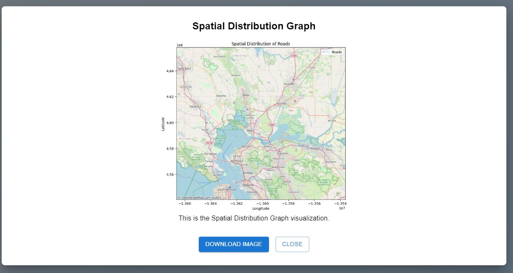

# IITJ-BDM-PROJECT-MAP360-WITH-OPENSTREETMAP-DATA


[![Contributors][contributors-shield]][contributors-url]  
[![Forks][forks-shield]][forks-url]  
[![Stargazers][stars-shield]][stars-url]  
[![Issues][issues-shield]][issues-url]  

---

## Interactive Map and Data Visualization API

This project utilizes **OpenStreetMap (OSM)** data to provide insights into urban mobility and infrastructure planning through interactive maps and visualizations. The system integrates multiple APIs for detailed spatial analysis and road network insights.

---

## Live Project Links
- **UI:** [http://54.160.26.39:5173/](http://54.160.26.39:5173/)
- **Backend:** [http://3.210.57.128:5000/](http://3.210.57.128:5000/)

---

## Setup Instructions

### Step 1: Create and Activate a Virtual Environment
```bash
python -m pip install virtualenv
python -m venv venv
source venv/Scripts/activate  # For Windows
source venv/bin/activate      # For macOS/Linux
```

### Step 2: Install Required Dependencies
```bash
pip install flask flask-cors google-cloud-bigquery pandas numpy networkx contextily geopandas folium google-cloud-bigquery-storage db-dtypes
```

### Step 3: Run the Application
Start the Flask app:
```bash
python run.py
```

---

## Folder Structure
```
project-root/
├── backend/
│   ├── routes/
│   │   ├── node_density.py
│   │   ├── road_analysis.py
│   │   ├── feature_analysis.py
│   ├── models/
│   │   ├── db_models.py
│   ├── utils/
│   │   ├── helpers.py
│   ├── run.py  # Entry point for the backend
├── frontend/
│   ├── public/
│   ├── src/
│   │   ├── components/
│   │   ├── App.js
│   │   ├── index.js
├── assets/
│   ├── *.JPG  # Visualization images and logos
├── README.md
```

---

## Summary of Routes

| Route                                | Description                                      |
|--------------------------------------|--------------------------------------------------|
| `/api/node_density_histogram`        | Histogram of node density by latitude.          |
| `/api/scatter_plot_lat_lon`          | Scatter plot of latitude vs longitude.          |
| `/api/road_length_distribution`      | Road length distribution histogram.             |
| `/api/feature_type_frequency`        | Bar chart of feature type frequency.            |
| `/api/node_density_heatmap`          | Heatmap of node density.                        |
| `/api/road_orientation_distribution` | Histogram of road orientations.                 |
| `/api/fetch_raw_data`                | Fetch raw data.                                 |
| `/api/road_type_distribution`        | Road type distribution visualization.           |
| `/api/query_all_tables`              | Fetch schema and data for all valid tables.     |
| `/api/traffic_flow_visualization`    | Analyze and visualize traffic flow.             |
| `/api/public_transport_analysis`     | Insights on public transport coverage.          |
| `/api/pedestrian_pathways`           | Visualization of pedestrian pathways.           |
| `/api/emergency_services_routes`     | Route optimization for emergency services.      |

---

## Key Features

### 1. Node Density Analysis
- Visualize node density using histograms and heatmaps.

### 2. Spatial Analysis
- Generate scatter plots of geographical coordinates (latitude and longitude).

### 3. Road Network Insights
- Analyze road lengths, types, and orientations with histograms and bar charts.

### 4. Feature Type Exploration
- Examine feature type frequencies to understand data distribution.

### 5. Traffic and Transport Analysis
- Gain insights into traffic flow and public transport accessibility.

### 6. Emergency Services Optimization
- Optimize routes for emergency services using geospatial data.

---

## Technologies Used

- **Backend Framework**: Flask, Flask-CORS
- **Data Source**: Google BigQuery
- **Data Analysis**: Pandas, GeoPandas, NetworkX
- **Data Visualization**: Folium, Matplotlib
- **Cloud Services**: Google Cloud BigQuery and BigQuery Storage
- **Frontend Framework**: React.js

---

## Visualization Samples
Here are examples of visualizations generated using this project:





---

## Screenshots of UI and Backend

### UI Components


### Backend Insights


---

## Contributions
Feel free to contribute by creating pull requests or submitting issues. Suggestions for improving visualization styles, data analysis methods, or UI enhancements are welcome.

---

## Authors

👤 **Shubham Raj**  
- Github: [@ShubhamRaj](https://github.com/shubham14p3)  
- Linkedin: [Shubham Raj](https://www.linkedin.com/in/shubham14p3/)

👤 **Bhagchandani Niraj**  
- Github: [@BhagchandaniNiraj](https://github.com/bhagchandaniniraj)  
- Linkedin: [Niraj Bhagchandani](https://linkedin.com/in/niraj-bhagchandani-218280201)

👤 **Bhavesh Arora**  
- Github: [@BhaveshArora](https://github.com/bhavesharora02)  
- Linkedin: [Bhavesh Arora](https://linkedin.com/in/bhavesh-arora-11b0a319b)

---

## Acknowledgments
- Project supported by [IIT Jodhpur](https://www.iitj.ac.in/).
- Inspired by OpenStreetMap for urban data insights.

---

## Future Upgrades
- Add predictive analysis for traffic patterns.
- Incorporate live data feeds for real-time insights.
- Expand feature analysis to include pedestrian pathways and public transport.

---

## Show Your Support
If you like this project, give it a ⭐ on GitHub!

[contributors-shield]: https://img.shields.io/github/contributors/shubham14p3/IITJ-BDM-URBAN-MOBILITY-AND-INFRASTRUCTURE-OPTIMIZATION-USING-OPENSTREETMAP-DATA.svg?style=flat-square
[contributors-url]: https://github.com/shubham14p3/IITJ-BDM-URBAN-MOBILITY-AND-INFRASTRUCTURE-OPTIMIZATION-USING-OPENSTREETMAP-DATA/graphs/contributors
[forks-shield]: https://img.shields.io/github/forks/shubham14p3/IITJ-BDM-URBAN-MOBILITY-AND-INFRASTRUCTURE-OPTIMIZATION-USING-OPENSTREETMAP-DATA.svg?style=flat-square
[forks-url]: https://github.com/shubham14p3/IITJ-BDM-URBAN-MOBILITY-AND-INFRASTRUCTURE-OPTIMIZATION-USING-OPENSTREETMAP-DATA/network/members
[stars-shield]: https://img.shields.io/github/stars/shubham14p3/IITJ-BDM-URBAN-MOBILITY-AND-INFRASTRUCTURE-OPTIMIZATION-USING-OPENSTREETMAP-DATA.svg?style=flat-square
[stars-url]: https://github.com/shubham14p3/IITJ-BDM-URBAN-MOBILITY-AND-INFRASTRUCTURE-OPTIMIZATION-USING-OPENSTREETMAP-DATA/stargazers
[issues-shield]: https://img.shields.io/github/issues/shubham14p3/IITJ-BDM-URBAN-MOBILITY-AND-INFRASTRUCTURE-OPTIMIZATION-USING-OPENSTREETMAP-DATA.svg?style=flat-square
[issues-url]: https://github.com/shubham14p3/IITJ-BDM-URBAN-MOBILITY-AND-INFRASTRUCTURE-OPTIMIZATION-USING-OPENSTREETMAP-DATA/issues

